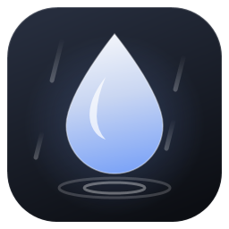

<p align="center"></p>

<h1 align="center">Rain</h1>

<p align="center">A dark, minimal local music player for Windows, with a blurred (acrylic) window on Windows 11.</p>

- Plays mp3, flac, m4a/aac, wav, wma and aiff from a folder you pick
- Cover art, shuffle, repeat, search, keyboard shortcuts
- Download songs by link (YouTube, SoundCloud, Bandcamp…) straight into your library, tagged with the cover embedded

## Download

Grab **Rain-win-Setup.exe** from the [latest release](https://github.com/haiderking1/Rain/releases/latest) and run it. No admin needed; it installs the .NET runtime if you don't have it, and Rain keeps itself up to date after that.

The first time you use the download button, Rain offers to fetch yt-dlp, ffmpeg and deno for you.

## Build

Needs the [.NET 10 SDK](https://dotnet.microsoft.com/download).

```
dotnet run --project src/Rain
```

Downloading needs [yt-dlp](https://github.com/yt-dlp/yt-dlp), [ffmpeg](https://ffmpeg.org) and [deno](https://deno.com) on your PATH, e.g. `scoop install yt-dlp ffmpeg deno`.

## Shortcuts

| Key | Action |
| --- | --- |
| Space | Play / pause |
| Ctrl+← / Ctrl+→ | Previous / next |
| Ctrl+F | Search |
| Enter / double-click | Play selected track |

Built with WPF, [NAudio](https://github.com/naudio/NAudio) and [TagLib#](https://github.com/mono/taglib-sharp).
